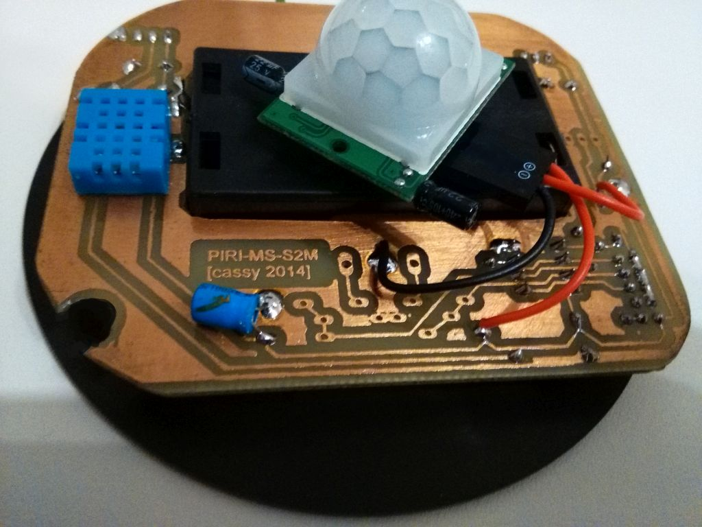
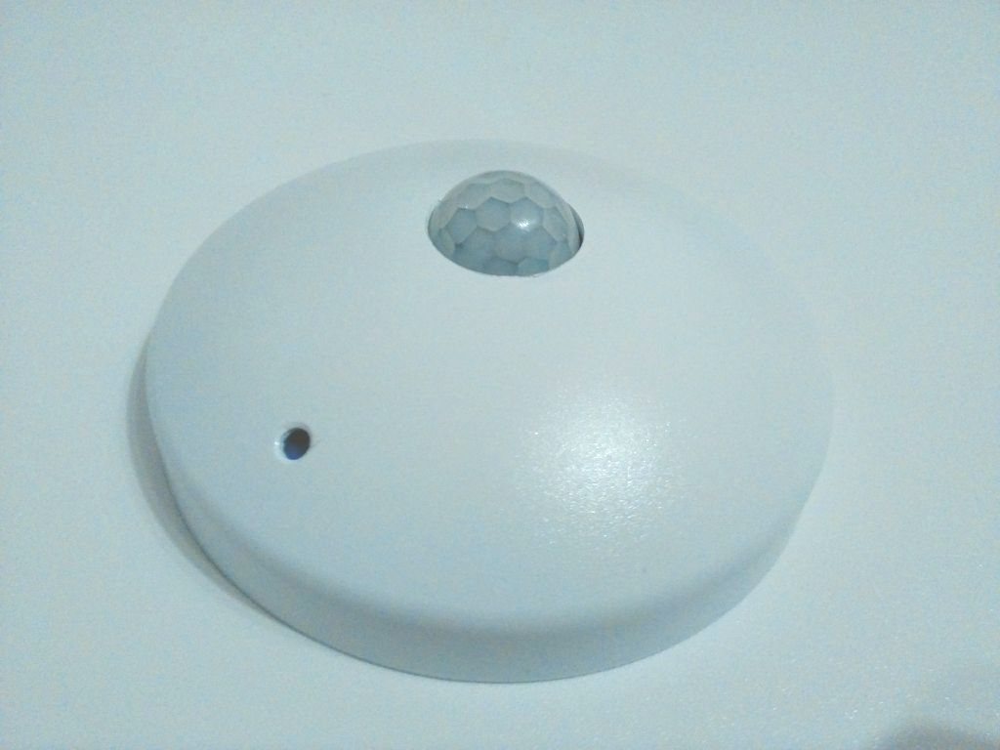

# PIRI-MS-S2M
PIRI-MS-S2M: Multisensor-Transmitter, basierend auf den beiden Funkprotokollen FS20 und FHT.

Der Passiv-Infrarotsensor detektiert Bewegungen und schickt diese via FS20 an die Zentrale oder Appliances, während die Messwerte der Temperatur und Luftfeuchtigkeit mittels FHT-Funkprotokoll an das Hausautomationsnetzwerk FHEM übermittelt werden. 

  

------------------

  

